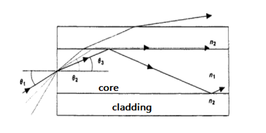
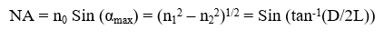

ऑप्टिकल फाइबर में एक बेलनाकार कोर होता है जिसका अपवर्तनांक n1 होता है और एक बाहरी क्लैडिंग होती है जिसका अपवर्तनांक n2 होता है, जहां n1 > n2। संकेत का प्रसार पूर्ण आंतरिक परावर्तन (Total Internal Reflection) की घटना पर आधारित होता है, जैसा कि नीचे दिए गए चित्र में दिखाया गया है:   
   

न्यूमेरिकल एपर्चर स्वीकृति कोण (Acceptance Angle) और शामिल तीन माध्यमों (कोर, क्लैडिंग और वायु) के अपवर्तनांकों के बीच संबंध स्थापित करता है और यह ऑप्टिकल फाइबर की एक मूलभूत विशेषता है। न्यूमेरिकल एपर्चर इनपुट स्वीकृति शंकु के आकार या खुलने की डिग्री का प्रतिनिधित्व करता है। गणितीय रूप से इसे स्वीकृति शंकु के आधे कोण के साइन के रूप में परिभाषित किया जाता है और यह फाइबर की प्रकाश-संग्रह करने की क्षमता का एक उपयोगी माप है। इसे निम्नलिखित रूप में दर्शाया जा सकता है:   
   

जहां,   
αmax = स्वीकृति शंकु का आधा कोण,   
n0 = वायु का अपवर्तनांक   
n1 = कोर का अपवर्तनांक   
n2 = क्लैडिंग का अपवर्तनांक   
D = स्क्रीन पर बिंदु का व्यास   
L = फाइबर के आउटपुट सिरे और स्क्रीन के बीच की दूरी।   

यदि घटना कोण α < αmax हो, तो किरण कोर और क्लैडिंग के इंटरफेस पर कई आंतरिक परावर्तन करती है और इसे गाइडेड रे (Guided Ray) कहा जाता है। यदि α > αmax हो, तो किरण कोर-क्लैडिंग इंटरफेस पर केवल आंशिक परावर्तन करती है। छोटे सीधे फाइबर में, आदर्श रूप से इनपुट सिरे पर कोण α पर शुरू हुई किरण आउटपुट सिरे पर भी उसी कोण α पर निकलती है। इसलिए, आउटपुट सिरे पर दूर का क्षेत्र (Far Field) भी एक शंकु के रूप में दिखाई देगा जिसका अर्ध कोण αmax होगा।  

यदि घटना कोण α > αmax हो, तो संकेत फाइबर में प्रवेश कर सकता है लेकिन फाइबर के माध्यम से प्रसारित नहीं हो सकता और यह विकृत हो जाएगा।  
