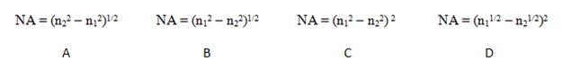
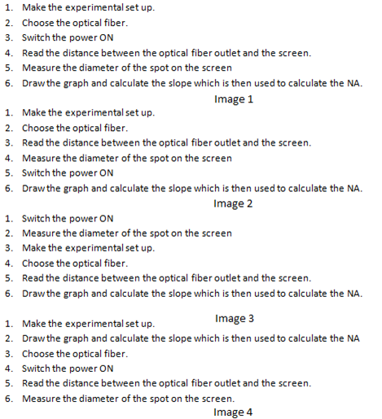

## शिक्षाशास्त्र (राउंड 1)

 
 
<b> प्रयोग: ऑप्टिकल फाइबर की न्यूमेरिकल एपर्चर का मापन    

<b>विषय | <b>भौतिक विज्ञान
:--|:--|
<b> प्रयोगशाला | <b> भौतिकी के मूल सिद्धांत
<b> प्रयोग | <b> 1. ऑप्टिकल फाइबर की न्यूमेरिकल एपर्चर का मापन

<h4> [1. ध्यान क्षेत्र](#LO)
<h4> [2. शिक्षण उद्देश्यों](#LO)
<h4> [3. शिक्षण रणनीति](#IS)
<h4> [4. कार्य और मूल्यांकन प्रश्न](#AQ)
<h4> [5. सिमुलेटर इंटरैक्शन](#SI)

#### 1. ध्यान क्षेत्र: सैद्धांतिक अवधारणा को मजबूत करना

#### 2. शिक्षण उद्देश्य और संज्ञानात्मक स्तर

क्र.सं. |	शिक्षण उद्देश्य	| संज्ञानात्मक स्तर | क्रिया शब्द
:--|:--|:--|:-:
1.| ऑप्टिकल फाइबर की न्यूमेरिकल एपर्चर और कोर व क्लैडिंग के अपवर्तनांक के बीच संबंध की पहचान करें। | स्मरण | पहचानें
2.| ऑप्टिकल फाइबर आउटलेट और स्क्रीन के बीच दूरी बदलने और स्क्रीन पर स्पॉट का व्यास मापने की कार्यप्रणाली का वर्णन करें। | समझें | वर्णन करें
3.| ऑप्टिकल फाइबर के अर्ध-स्वीकृति कोण का पूर्वानुमान लगाएं। | लागू करें | पूर्वानुमान लगाएं
4.| ग्राफ का ढलान जांचें और αmax का मान निकालें। | विश्लेषण करें | जांचें
5.| दिए गए ऑप्टिकल फाइबर की न्यूमेरिकल एपर्चर का निष्कर्ष निकालें। | मूल्यांकन करें | निष्कर्ष निकालें

 

    <b><a href="#top">↥ ऊपर वापस जाएं</a></b>

 

#### 3. शिक्षण रणनीति
###### शिक्षण रणनीति का नाम: विवरणात्मक
###### मूल्यांकन विधि: हैंडआउट के अनुसार

<u> <b>विवरण:</b> इस सिम्युलेटर में उपरोक्त शिक्षण रणनीति को कैसे लागू किया जाएगा: </u>
 
 हैंडआउट के अनुसार संक्षिप्त विवरण

 

    <b><a href="#top">↥ ऊपर वापस जाएं</a></b>

 

#### 4. कार्य और मूल्यांकन प्रश्न:

सिद्धांत पढ़ें और प्रयोग से संबंधित अवधारणाओं को समझें। [LO1, LO2, LO3]
 

क्र.सं. |	शिक्षण उद्देश्य	| सिम्युलेटर में छात्र द्वारा किए जाने वाले कार्य | मूल्यांकन प्रश्न
:--|:--|:--|:-:
1.| छात्र ऑप्टिकल फाइबर की न्यूमेरिकल एपर्चर और कोर व क्लैडिंग के अपवर्तनांक के बीच संबंध की पहचान करेंगे। | छात्र कोर और क्लैडिंग के अपवर्तनांक के साथ न्यूमेरिकल एपर्चर के संबंध के लिए 4 छवियां दी जाएंगी और उन्हें सही छवि चुननी होगी। | न्यूमेरिकल एपर्चर और कोर व क्लैडिंग के अपवर्तनांक के लिए सही छवि चुनें: a) A   b) B  c) C  d) D 
2.| छात्र स्क्रीन पर स्पॉट का व्यास मापने और ऑप्टिकल फाइबर आउटलेट और स्क्रीन के बीच दूरी बदलने की कार्यप्रणाली का वर्णन करेंगे। | छात्र को प्रक्रिया के सही क्रम की छवियां दी जाएंगी और उन्हें सही छवि चुननी होगी। | इस प्रयोग में पालन की जाने वाली प्रक्रिया का सही क्रम दिखाने वाली छवि चुनें:  A. छवि1   B. छवि2   C. छवि3   <b> D. छवि4 </b>  
3.| छात्र ऑप्टिकल फाइबर के अर्ध-स्वीकृति कोण का ग्राफ बनाकर पूर्वानुमान लगाएंगे। | छात्र ग्राफ तैयार करेंगे। | ऑप्टिकल फाइबर के अर्ध-स्वीकृति कोण का ग्राफ:  A. सकारात्मक ढलान और सकारात्मक इंटरसेप्ट के साथ सीधी रेखा   B. नकारात्मक ढलान और सकारात्मक इंटरसेप्ट के साथ सीधी रेखा   C. नकारात्मक ढलान और नकारात्मक इंटरसेप्ट के साथ सीधी रेखा   D. सकारात्मक ढलान और नकारात्मक इंटरसेप्ट के साथ सीधी रेखा  
4.| छात्र ग्राफ के ढलान की जांच करेंगे और αmax का मान निकालेंगे। | छात्र αmax से न्यूमेरिकल एपर्चर की गणना करेंगे। | एकल मोड ऑप्टिकल फाइबर की न्यूमेरिकल एपर्चर का मान:  a) 0.2   b) 2.0   c) 20   d) 200  
5.| छात्र न्यूमेरिकल एपर्चर का निष्कर्ष निकालेंगे। | छात्र नए ऑप्टिकल फाइबर के साथ प्रयोग दोहराएंगे। | बहु-मोड ऑप्टिकल फाइबर की न्यूमेरिकल एपर्चर का मान:  a) 0.5   b) 5.0   c) 50   d) 500  

  

    <b><a href="#top">↥ ऊपर वापस जाएं</a></b>

 

#### 5. सिम्युलेटर इंटरैक्शन:
 

क्र.सं. | छात्र क्या करेंगे? | सिम्युलेटर क्या करेगा? | कार्य का उद्देश्य
:--|:--|:--|:--:
1.| सिम्युलेटर छात्र को सेटअप बनाने की अनुमति देगा और गलत सेटअप के मामले में सतर्क करेगा। | छात्र ऑप्टिकल फाइबर का चयन करेंगे और सिम्युलेटर का पावर बटन चालू करेंगे। | सिम्युलेटर प्रारंभ करना
2.| सिम्युलेटर हरे रंग का प्रकाश दिखाएगा जो उपयोग के लिए तैयार होने का संकेत देगा। | छात्र स्क्रीन पर स्पॉट का व्यास मापने के लिए ऑप्टिकल फाइबर आउटलेट और स्क्रीन के बीच दूरी बदलेंगे। | अर्ध-स्वीकृति कोण का मान प्राप्त करना।
3.| सिम्युलेटर स्क्रीन पर स्पॉट का व्यास दिखाएगा। | छात्र तालिका में मान दर्ज करेंगे। | D और L मान प्राप्त करना।
4.| सिम्युलेटर तालिका में D और L मान गणना करेगा। | छात्र ग्राफ बटन दबाएंगे। | ग्राफ बनाना।
5.| सिम्युलेटर D और L का ग्राफ दिखाएगा। | छात्र ग्राफ के ढलान से न्यूमेरिकल एपर्चर की गणना करेंगे। | न्यूमेरिकल एपर्चर की गणना।
6.| ग्राफ का ढलान सिम्युलेटर द्वारा प्रदर्शित किया जाएगा। | छात्र प्रयोग दोहराएंगे। | विभिन्न फाइबर का विश्लेषण। 
